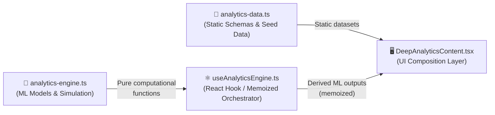
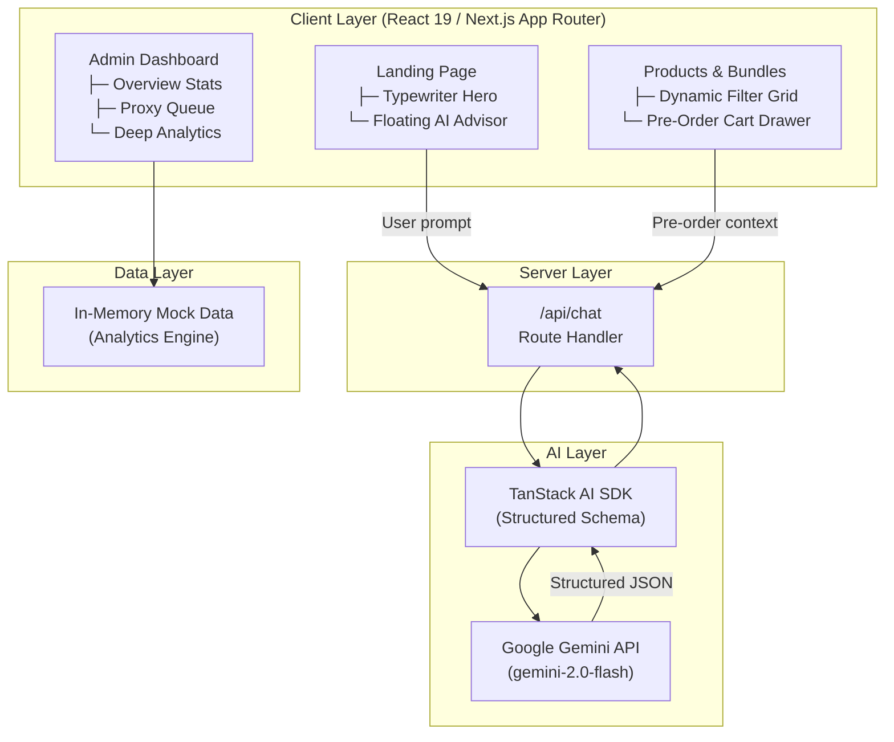

# 🏮 Hin Long Joss Sticks & Papers

> **AI-powered heritage offering advisor and operational business intelligence platform** for traditional Chinese ritual commerce — built with Next.js 16 (App Router), React 19, and Google Gemini.
> 
> [](https://vercel.com)
> [](https://nextjs.org)
> [](https://www.typescriptlang.org)
> [](https://pnpm.io)

---

## 📊 Admin Analytics Dashboard

> The Deep Analytics module implements a self-contained, production-style business intelligence system with custom ML models running entirely in the browser — no external data science API required.

### Route

Files related to the analytics module can be found at:

```
/src/app/admin/analytics
```

Access requires login with the admin account (`admin@gmail.com` / `test123`).

---

### Architecture: Three-Tier Analytics Pipeline

The analytics system is intentionally decoupled into three distinct layers and can be found at `/src/app/admin/analytics`:



---

### Layer 1 — Data Foundation (`src/app/admin/analytics/_lib/analytics-data.ts`)

Defines all static seed datasets consumed by the charts. Acts as the schema contract between the data layer and the UI components.

**Key exports:**

| Export                     | Description                                                       |
| :------------------------- | :---------------------------------------------------------------- |
| `revenueData`              | 12-month revenue + order counts with festival peak annotations    |
| `bundlePerformanceData`    | Sales, views, conversion rates per bundle                         |
| `customerGroupRevenueData` | Revenue, retention, AOV segmented by dialect group                |
| `peakSeasonForecastData`   | Seasonal demand lift % with confidence scores                     |
| `proxyCapacityData`        | Projected proxy request volume vs. capacity limit                 |
| `propensityData`           | Membership purchase propensity by engagement cohort               |
| `cartGapData`              | Cultural cart-gap analysis (missing complements by dialect group) |
| `ageDemographicData`       | Proxy bookings vs. DIY bundles vs. memberships by age bracket     |
| `geographicData`           | Local (SG) vs. overseas customer retention and AOV                |
| `GROUP_BAR_COLORS`         | Ordered color palette for grouped bar charts                      |

---

### Layer 2 — Analytics Engine (`src/app/admin/analytics/_lib/analytics-engine.ts`)

#### Deterministic PRNG

| Function                      | Description                                   |
| :---------------------------- | :-------------------------------------------- |
| `hashSeed(seed)`              | FNV-1a 32-bit hash of a string seed → integer |
| `mulberry32(seedInt)`         | Returns a seeded `() => number` PRNG closure  |
| `randRange(random, min, max)` | Uniform float in `[min, max)` from PRNG       |

#### Synthetic Data Generation

| Function               | Signature                                                   | Description                                                                                                   |
| :--------------------- | :---------------------------------------------------------- | :------------------------------------------------------------------------------------------------------------ |
| `generateSalesHistory` | `({ days, seed, baseDate }) → SalesRecord[]`                | Generates N days of revenue data with weekly seasonality, growth trend, stochastic noise, and weekend penalty |
| `generateCustomers`    | `({ count, seed }) → CustomerProfile[]`                     | Generates customers with RFM attributes and dialect group distribution matching real Singapore market weights |
| `generateFeedback`     | `({ customers, count, seed, baseDate }) → FeedbackRecord[]` | Procedurally generates feedback texts with 50% positive / 28% neutral / 22% negative distribution             |

#### Predictive Models

**Demand Forecasting — OLS Linear Regression**

```
runLinearRegressionDemandForecast(history, forecastDays) → RegressionResult
```

Fits a least-squares regression line over N days of historical revenue and projects forward `forecastDays` days. Returns both the `historical-fit` overlay and `forecast` points.

**Churn Risk — Logistic Regression Scorer**

```
scoreCustomerChurn(customer) → ChurnRiskResult { probability, riskLevel }
```

Applies a hand-tuned sigmoid model over normalised RFM features:

```
z = -1.35 + 3.1·recency - 2.25·frequency - 1.1·spend
probability = σ(z)
riskLevel = "High" (≥0.70) | "Medium" (0.40–0.69) | "Low" (<0.40)
```

**Sentiment Analysis — Rule-Based NLP**

```
analyzeSentiment(text) → { score: number, label: "Positive" | "Neutral" | "Negative" }
```

Tokenises feedback text, scores against curated `POSITIVE_WORDS` / `NEGATIVE_WORDS` lexicons, applies intensity multipliers (`very`, `extremely` → ×1.5) and negation flip (`not`, `never` → ×−1). Score threshold: `> 0.5 → Positive`, `< −0.5 → Negative`.

```
analyzeFeedbackBatch(feedback[]) → SentimentResult[]
```

Batch wrapper — maps `analyzeSentiment` over an array of `FeedbackRecord` objects.

---

### Layer 3 — React Orchestrator (`useAnalyticsEngine.ts`)

A single `useMemo`-wrapped hook that runs the entire computation pipeline once per mount.

```ts
const {
  adaptedSurgingProducts, // Top 5 trending inventory items with ML-projected demand
  localChurnProbability, // Mean churn probability for local (SG) customers
  overseasChurnProbability, // Mean churn probability for overseas customers
  churnGapPct, // Relative gap: (local − overseas) / local × 100
  dominantSentiment, // "Positive" | "Neutral" | "Negative"
  positiveShare, // % of feedback classified as Positive
} = useAnalyticsEngine();
```

**Internal pipeline:**

1. `generateSalesHistory` → 90-day sales records
2. `runLinearRegressionDemandForecast` → 30-day projection
3. Map top `up`-trending `MOCK_INVENTORY` items to regression growth %
4. `generateCustomers` → 180 synthetic customer profiles
5. `scoreCustomerChurn` on each customer → segment into local / overseas
6. `generateFeedback` → 260 feedback records
7. `analyzeFeedbackBatch` → sentiment distribution + dominant label

---

### Dashboard Sections & Charts

| Section                  | Chart Type                      | Data Source                | Key Insight                                                   |
| :----------------------- | :------------------------------ | :------------------------- | :------------------------------------------------------------ |
| **Annual Revenue Trend** | `<AreaChart>`                   | `revenueData`              | Revenue spike annotations for Qingming, Ghost Month, CNY      |
| **Top Product Bundles**  | `<BarChart>` (horizontal)       | `bundlePerformanceData`    | Sales volume ranking                                          |
| **Peak Season Forecast** | Static cards                    | `peakSeasonForecastData`   | Demand lift % with countdown and confidence                   |
| **Proxy Capacity Risk**  | `<ComposedChart>` (Area + Line) | `proxyCapacityData`        | Projected requests vs. hard capacity limit                    |
| **Surging Products**     | Custom cards                    | `MOCK_INVENTORY` + ML      | Regression-calibrated projected demand %                      |
| **Cart-Gap Analysis**    | Table cards                     | `cartGapData`              | Missing complements by dialect group + revenue opportunity    |
| **Demographic Analysis** | `<BarChart>` (grouped)          | `ageDemographicData`       | Gen Z vs. Millennial vs. Gen X vs. Senior purchasing patterns |
| **Sentiment Summary**    | Stat badges                     | `useAnalyticsEngine`       | NLP-derived positive share from 260 feedback records          |
| **Customer Group Stats** | Table                           | `customerGroupRevenueData` | Revenue, retention, AOV segmented by Chinese dialect group    |
| **Regional Insights**    | Table                           | `geographicData`           | Local vs. overseas order value and retention rate             |
| **Product Velocity**     | Table                           | `MOCK_INVENTORY`           | Weekly velocity, trend direction, projected demand            |
| **Geographic Summary**   | Stat cards                      | `geographicData`           | High-level local vs. overseas performance                     |

### CSV Export

The **Export CSV** button (top-right of the analytics page) triggers `handleExportCSV` from `src/app/admin/analytics/_lib/export-utils.ts`.

It generates a single multi-section `.csv` file containing:

- Inventory velocity tracker
- Annual revenue & orders
- Proxy capacity forecast
- Geographic analytics
- Membership propensity
- Cultural cart-gaps

File is named: `hinlong_deep_analytics_YYYY-MM-DD.csv`

## 💡 Why This Exists

Traditional Chinese rituals — Qingming, Hungry Ghost Month, Ancestor Remembrance — require deep cultural knowledge to perform correctly. Most customers do not know whether to buy prebuilt bundles, which individual items complement specific rituals, or how offerings differ across dialect groups (Hokkien, Teochew, Cantonese, etc.).

This application removes that friction by:

1. **Guiding customers** via an AI Advisor (Google Gemini) that returns structured, culturally-accurate recommendations linking back to live product and bundle detail pages.
2. **Empowering the store owner** with a comprehensive admin dashboard — featuring an operational overview, proxy queue management, real-time inventory tracking, and a deep analytics module backed by purpose-built machine learning models.

---

## ✨ Features

### Customer Side

- **Heritage Calendar**: Dual Gregorian/Lunar calendar covering major festivals (Qingming, Hungry Ghost Month, Guan Yin's Enlightenment Day) with ritual date reminders.
- **Product Catalog**: Curated bundles (Qingming Essential Kit, 7th Month Hungry Ghost Bundle, CNY Wealth & Prosperity Set) and standalone offerings (joss paper, incense, candles, paper clothing).
- **Pre-Order Cart**: Persistent slide-out drawer for staging product and bundle orders.
- **AI Heritage Advisor**: Floating Gemini-powered assistant that surfaces culturally appropriate bundles and items for a given occasion or ancestor.
- **Remembrance Dashboard**: Ancestral registry storing dialect group, relationship, and birth/passing anniversaries.
- **Checkout**: Unified flow for physical product orders and proxy service bookings.
- **Store Locator**: Embedded Google Maps view of the physical store.
- **Dark / Light Mode**: System-aware theme toggle across all pages.

#### Free Tier

- Calendar views and public festival dates
- Basic AI guidance and product browsing
- Ancestral profile management

#### Premium Tier ($12.90 / month)

- **Proxy Burning Service** — Professional ritual fulfilment on behalf of the customer
- **Video Proof** — Recorded confirmation of proxy ritual completion
- **Advanced AI Personalisation** — Dialect-aware bundle recommendations
- **Ritual Alerts** — Notifications on ancestor birth/passing anniversaries
- **Ritual History** — Full log of past proxy orders and offering preferences

### Owner Side

- **Operational Dashboard**: Live KPI cards — active preorders, weekly revenue, and service queue volume.
- **Proxy Queue**: Workflow to start fulfilment, mark completion, and attach video proof per member booking.
- **Deep Analytics**: BI dashboard with dialect-group retention, bundle conversion, churn risk, sentiment analysis, and cart-gap opportunities. See [Admin Analytics Dashboard](#-admin-analytics-dashboard).
- **AI-Driven Forecasting**: Peak-season demand lift % with confidence levels for proactive inventory planning.
- **Inventory Control**: Stock velocity tracking with low-inventory alerts for critical items.

---

## 🏗️ Architecture



| Layer                | Component                                | Purpose                                                          |
| :------------------- | :--------------------------------------- | :--------------------------------------------------------------- |
| **Frontend**         | Next.js 16 App Router                    | SSR pages with React 19 and Tailwind CSS v4                      |
| **Animation**        | Framer Motion + GSAP + Lenis             | Stagger transitions, scroll-linked animations, smooth scroll     |
| **AI Generation**    | TanStack AI + Google Gemini              | Structured JSON output constrained by Zod schema                 |
| **Analytics Engine** | Custom TypeScript models                 | OLS regression, logistic churn scoring, rule-based NLP sentiment |
| **Charts**           | Recharts 3 via shadcn `<ChartContainer>` | Area, Bar, ComposedChart within design-system wrappers           |
| **Auth**             | Client-side AuthContext (localStorage)   | Role-based access: `customer` / `admin`                          |
| **Database**         | Drizzle ORM + Supabase (PostgreSQL)      | Schema definition, migrations, product seeding                   |
| **UI Components**    | shadcn/ui + Radix UI                     | Accessible primitives, drawers, cards, tabs, badges              |

---

## 🛠️ Tech Stack

| Category                  | Technology                                                                                                                        |
| :------------------------ | :-------------------------------------------------------------------------------------------------------------------------------- |
| **Framework**             | [Next.js](https://nextjs.org/) 16 (App Router)                                                                                    |
| **Language**              | [TypeScript](https://www.typescriptlang.org/) ~6.0 — strict mode                                                                  |
| **Runtime**               | [Node.js](https://nodejs.org/) ≥ 24.14                                                                                            |
| **Package Manager**       | [pnpm](https://pnpm.io/) 10.30.1                                                                                                  |
| **Styling**               | [Tailwind CSS](https://tailwindcss.com/) v4 + `tw-animate-css`                                                                    |
| **UI Components**         | [shadcn/ui](https://ui.shadcn.com/) + [Radix UI](https://www.radix-ui.com/) + [Lucide React](https://lucide.dev/)                 |
| **Animation**             | [Framer Motion](https://www.framer.com/motion/) 12 + [GSAP](https://gsap.com/) 3 + [Lenis](https://lenis.darkroom.engineering/) 1 |
| **AI**                    | [TanStack AI](https://tanstack.com/ai) wrapper → [Google Gemini](https://ai.google.dev/) (gemini-2.0-flash)                       |
| **Charts**                | [Recharts](https://recharts.org/) 3 wrapped in shadcn `<ChartContainer>`                                                          |
| **Database**              | [Drizzle ORM](https://orm.drizzle.team/) + [Supabase](https://supabase.com/) (PostgreSQL) + `pg` driver                           |
| **Validation**            | [Zod](https://zod.dev/) v4                                                                                                        |
| **Logging**               | [Pino](https://getpino.io/) + `pino-pretty`                                                                                       |
| **Linting / Format**      | [oxlint](https://oxc.rs/docs/guide/usage/linter) + [oxfmt](https://oxc.rs/docs/guide/usage/formatter)                             |
| **Git Hooks**             | [Husky](https://typicode.github.io/husky/) + [lint-staged](https://github.com/lint-staged/lint-staged)                            |
| **CI/CD**                 | GitHub Actions → Vercel                                                                                                           |
| **Analytics (Telemetry)** | [@vercel/analytics](https://vercel.com/analytics)                                                                                 |

---

## 🚀 Getting Started

### Prerequisites

| Tool                                      | Version                                     |
| :---------------------------------------- | :------------------------------------------ |
| [Node.js](https://nodejs.org/)            | `>= 24.14`                                  |
| [pnpm](https://pnpm.io/)                  | `>= 10.30.1`                                |
| [Supabase Project](https://supabase.com/) | (for local DB, or use provided credentials) |

### Installation

```bash
# 1. Clone the repository
git clone <repository-url>
cd my-legacy

# 2. Install dependencies (exact lockfile)
pnpm install --frozen-lockfile
```

### Environment Configuration

Copy and fill in the following environment variables in a `.env` file at the project root:

```bash
# Google Gemini — AI Advisor
GEMINI_API_KEY=your_google_gemini_api_key

# Google Maps
NEXT_PUBLIC_GOOGLE_MAPS_API_KEY=your_google_maps_api_key
```

| Variable         | Required | Description                                       |
| :--------------- | :------: | :------------------------------------------------ |
| `GEMINI_API_KEY` |    ✅    | API key for Google Gemini powering the AI Advisor |
| `DATABASE_URL`   |    ✅    | PostgreSQL connection string (Supabase or local)  |

### Running Locally

```bash
pnpm run dev
```

The app will be available at **http://localhost:3000**.

**Default test credentials:**

| Role     | Email             | Password  |
| :------- | :---------------- | :-------- |
| Admin    | `admin@gmail.com` | `test123` |
| Customer | `rey@gmail.com`   | `test123` |

---

## 📂 Project Structure

```
my-legacy/
├── .github/workflows/          # CI/CD pipeline
├── .husky/                     # Git hooks
├── public/                     # Static assets
├── src/
│   ├── app/
│   │   ├── _components/        # Shared page-level components
│   │   ├── admin/              # 🔐 Admin-only routes
│   │   │   ├── analytics/      # 📊 Deep Analytics module
│   │   │   ├── forecast/       # Demand forecast view
│   │   │   ├── inventory/      # Inventory management
│   │   │   ├── orders/         # Order management
│   │   │   ├── proxy-orders/   # Proxy order fulfilment
│   │   │   └── proxy-queue/    # Real-time proxy queue management
│   │   ├── api/chat/           # POST /api/chat — TanStack AI + Gemini
│   │   ├── bundles/            # Bundle listing and detail pages
│   │   ├── calendar/           # Ritual calendar view
│   │   ├── checkout/           # Checkout flow
│   │   ├── login/              # Auth — login page
│   │   ├── membership/         # Membership tier upgrade
│   │   ├── our-story/          # Brand story page
│   │   ├── products/           # Product catalogue and detail pages
│   │   ├── profile/            # User profile management
│   │   ├── proxy-request/      # Customer proxy ritual request form
│   │   ├── remembrance/        # Remembrance / ancestral service page
│   │   └── signup/             # Auth — registration page
│   ├── components/             # Shared UI (AIAdvisor, Navigation, CartDrawer…)
│   │   └── ui/                 # shadcn/ui primitives
│   ├── context/                # React context providers (Auth, PreOrder)
│   ├── data/                   # Static/mock datasets
│   ├── db/                     # Drizzle ORM — schema, client, seed
│   └── lib/                    # Pure libraries (analytics-engine, logger, utils)
├── components.json
├── drizzle.config.ts
├── next.config.ts
└── tsconfig.json
```

---

## 🧑‍💻 Development Scripts

```bash
pnpm run dev          # Start Next.js development server
pnpm run build        # Production build
pnpm run start        # Serve production build locally
pnpm run lint         # Run oxlint
pnpm run format       # Run oxfmt formatter
```
