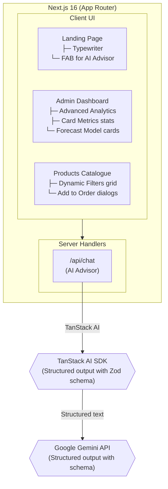

# 🏮 Hin Long Joss Sticks & Papers

> AI-powered Heritage offering advisor and operational dashboard for traditional Chinese rituals, offering accurate structured recommendations via Google Gemini, built with Next.js 16 and deployed on Vercel.

## 💡 Why This Exists

Traditional Chinese rituals (Qingming, Hungry Ghost, Ancestor remembrance) require deep cultural knowledge regarding offering items. Most buyers do not know whether to buy prebuilt bundles or which items to complement rituals. This application removes that friction by leveraging **Google Gemini** and **TanStack AI** to guide clients via structured AI-based suggestions on what is culturally accurate and respectful to prepare.

Users simply type a prompt (e.g., "Help preparing for Qingming Festival"), and receive a structured deck of recommendations, recommended bundles, and helpful procedural tips.

## 🏗️ Architecture



| Layer             | Component                   | Purpose                                                                                                                            |
| ----------------- | --------------------------- | ---------------------------------------------------------------------------------------------------------------------------------- |
| **Frontend**      | Next.js 16 App Router       | Server-rendered pages with React 19, standard components, and Tailwind CSS v4                                                      |
| **AI Generation** | TanStack AI + Google Gemini | Structured JSON output with Zod schema validation, answering rituals accurately referencing existing store dataset configurations. |
| **Analytics**     | Recharts                    | Live visual rendering grid in Dashboard mapping revenue and seasonal spikes increments.                                            |
| **Components**    | shadcn/ui                   | Immersive drawer, tabs, cards, tables formats overlays adhering to high-aesthetic brand palettes nodes setups.                     |

## 🛠️ Tech Stack

| Category        | Technology                                                                                                |
| --------------- | --------------------------------------------------------------------------------------------------------- |
| Framework       | [Next.js](https://nextjs.org/) 16 (App Router) with [React](https://react.dev/) 19                        |
| Language        | [TypeScript](https://www.typescriptlang.org/) (ESNext - strict mode)                                      |
| Runtime         | [Node.js](https://bun.sh/) ≥ 24.14                                                                        |
| Styling         | [Tailwind CSS](https://tailwindcss.com/) v4                                                               |
| UI Components   | [Radix UI](https://www.radix-ui.com/) primitives, [shadcn/ui](https://ui.shadcn.com/), Lucide React icons |
| AI              | [TanStack AI](https://tanstack.com/ai) wrapper over [Google Gemini](https://ai.google.dev/)               |
| Charts          | [Recharts](https://recharts.org/en-US/) wrapped behind Dynamic shadcn container templates                 |
| Package Manager | [pnpm](https://pnpm.io/) 10.30.1                                                                          |

## 🚀 Getting Started

### ✅ Prerequisites

| Tool                           | Version      |
| ------------------------------ | ------------ |
| [pnpm](https://pnpm.io/)       | `>= 10.30.1` |
| [Node.js](https://nodejs.org/) | `>= 24.14`   |

### 📦 Installation

```bash
# Clone the repository
git clone <repository-url>
cd dbtt-project

# Install dependencies
pnpm install --frozen-lockfile
```

### ⚙️ Configuration

Create the `.env` configuration file and fill in required keys:

```bash
# inside setup
GEMINI_API_KEY=your_google_gemini_api_key
```

| Variable         | Description                                                         |
| ---------------- | ------------------------------------------------------------------- |
| `GEMINI_API_KEY` | REQUIRED: API key for Google Gemini servicing the AI representation |

## 🧑‍💻 Usage

**Run the development server** (uses Next.js dev server):

```bash
pnpm run dev
```

**Build for production:**

```bash
pnpm run build
```

**Start the production server:**

```bash
pnpm run start
```

## 📂 Project Structure

```
dbtt-project/
├── .github/workflows/        # CI/CD pipelines deployment buffers
├── src/
│   ├── app/
│   │   ├── admin/                # Dashboard graphs metrics overlays
│   │   ├── api/chat/             # AI Advisor Tanstack endpoint router
│   │   ├── bundles/              # Pricing tier sets packages layout
│   │   ├── products/             # Standalone goods index layout
│   │   └── layout.tsx            # Global layout wrapper handles variables
│   ├── components/
│   │   ├── AIAdvisor.tsx         # Floating drawer dialog AI assistant
│   │   ├── Navigation.tsx        # Responsive navbar sticky layers triggers
│   │   └── ui/                   # shadcn/ui shared primitives layouts
│   ├── data/
│   │   ├── bundles.ts            # Available prebaked kits definitions dataset
│   │   ├── rituals.ts            # Standalone items catalog lists
│   │   └── mock-orders.ts        # Operations analytic mocks variables
│   └── globals.css               # Tailwind v4 standard variables index setup
├── package.json
└── next.config.ts                # App configuration router
```
